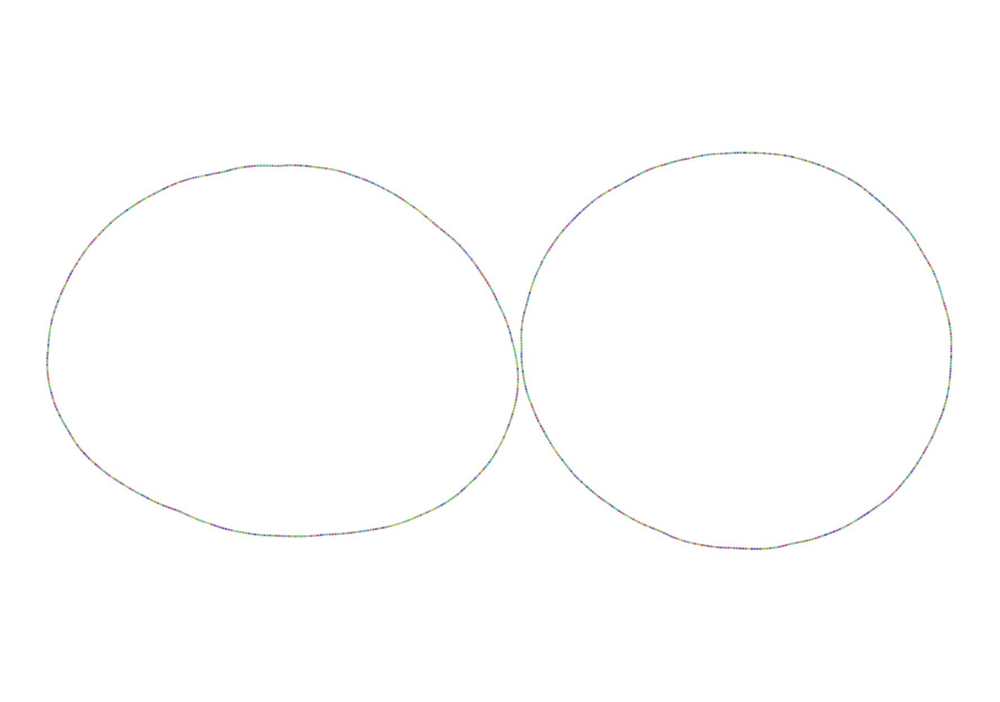
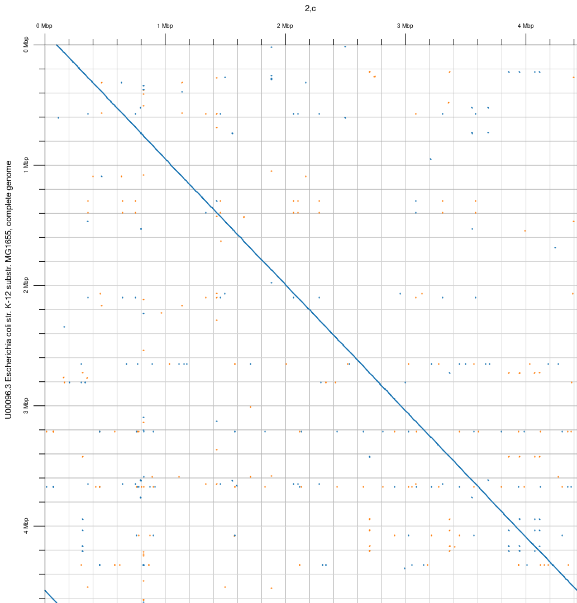
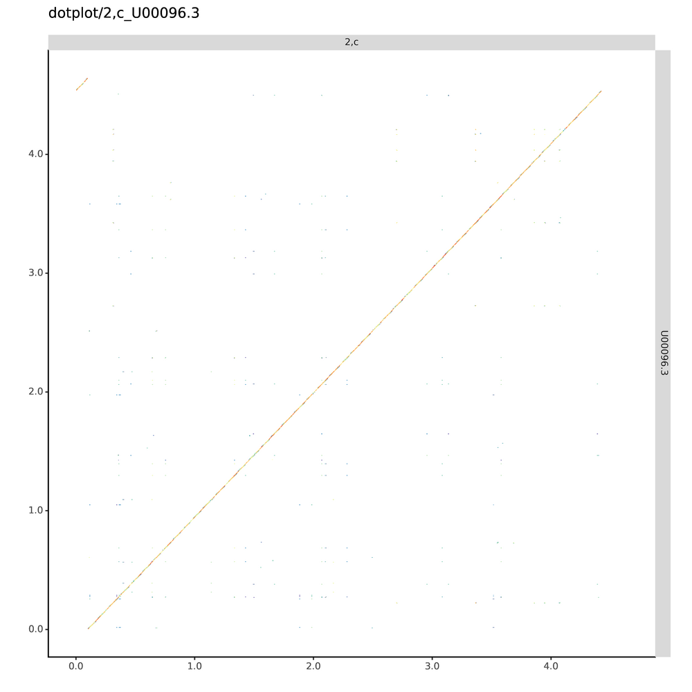
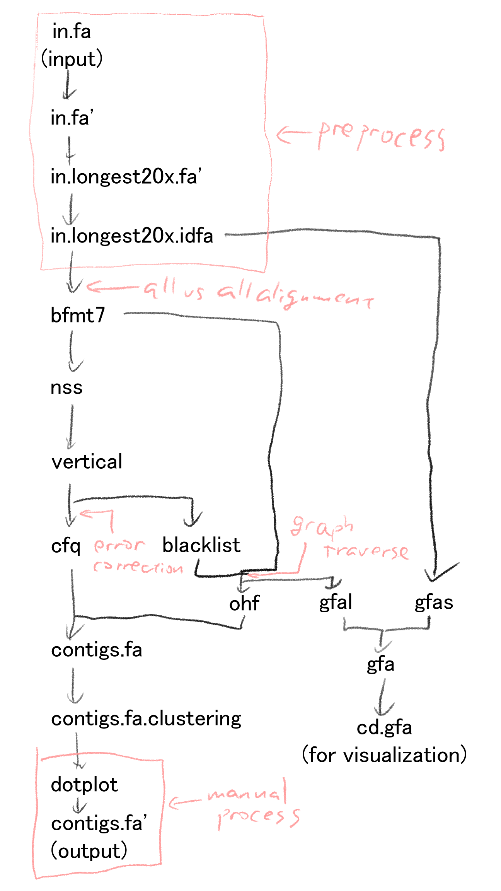
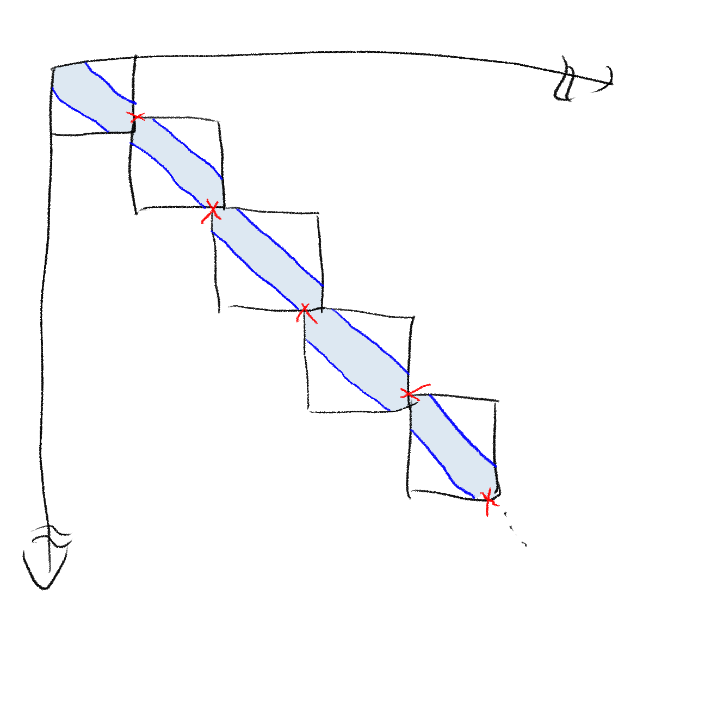
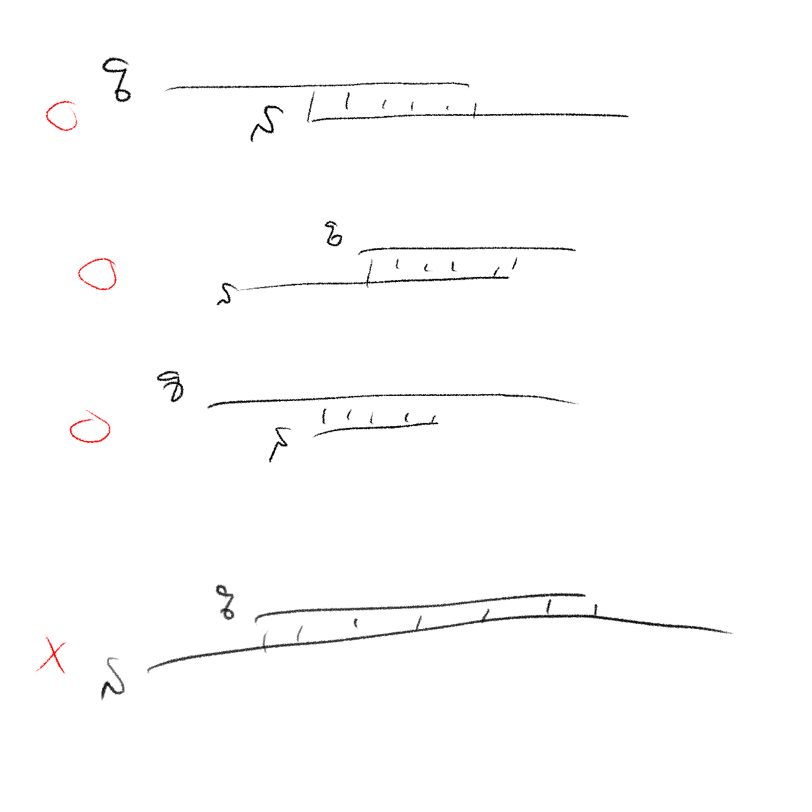
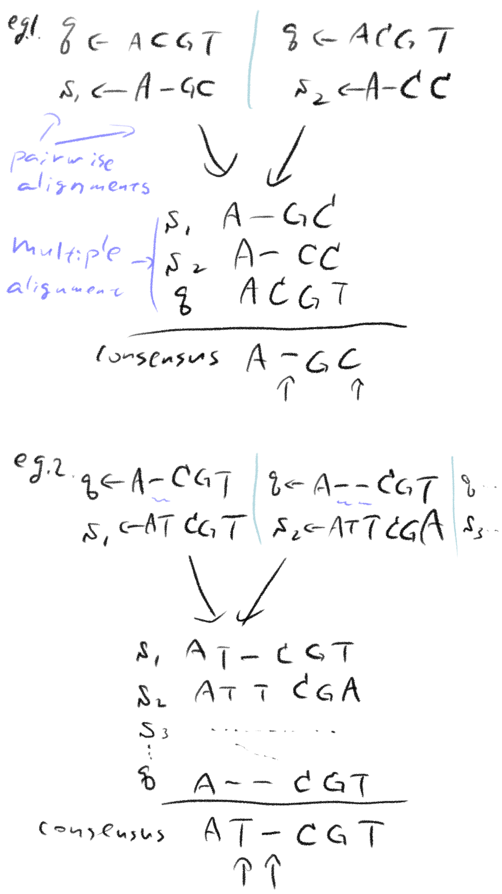
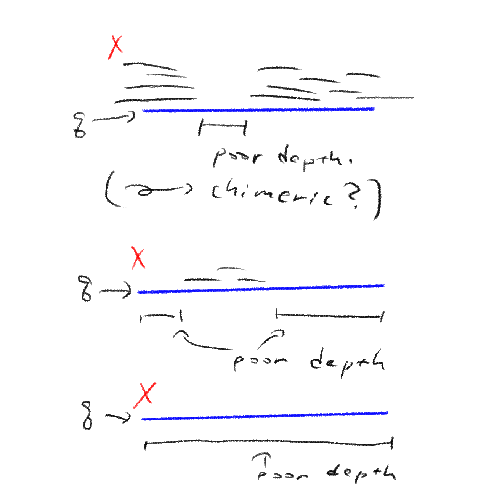
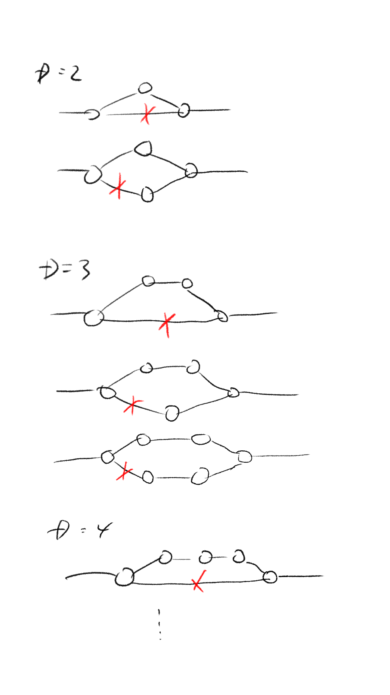
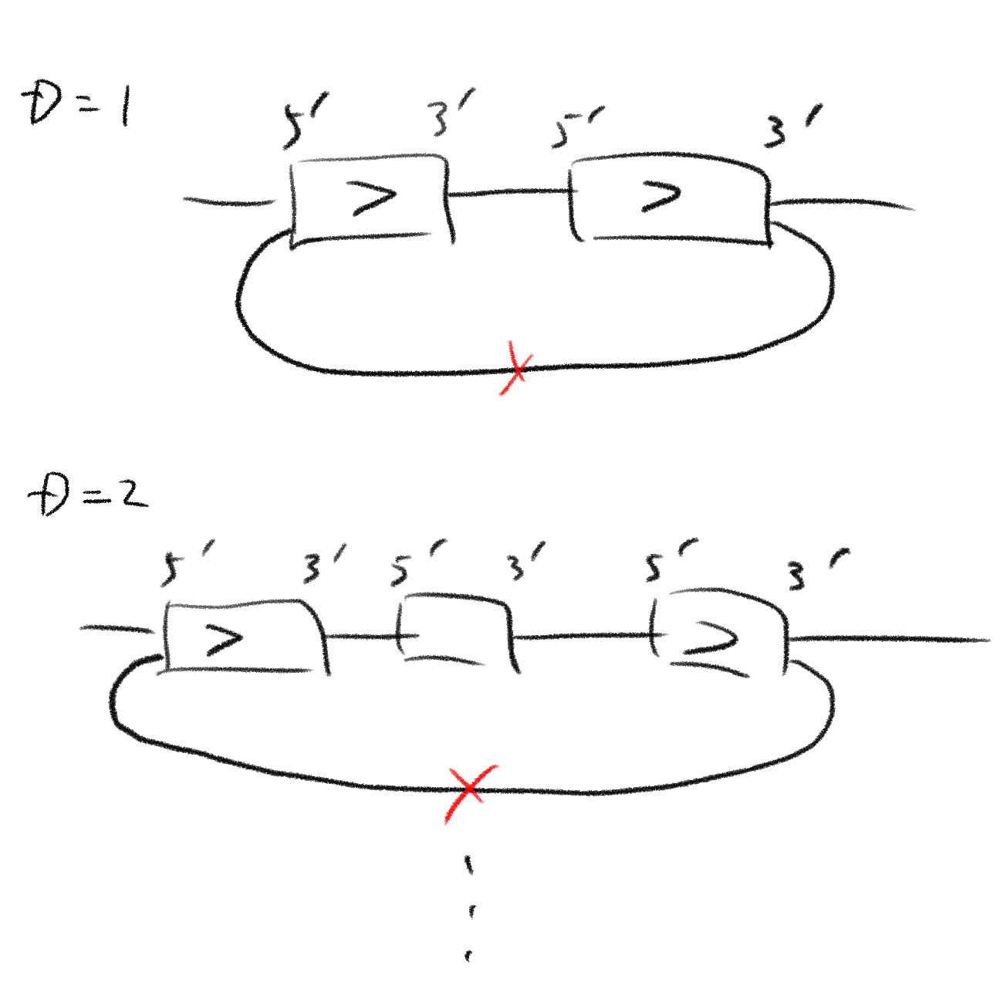

# NOisy Read Assembler (nora) とは

オックスフォードナノポア用のデノボアセンブラです。 
アキュラシーが70～80% 程度の長いリードをインプットとして想定しており、コンティグをFASTA形式で出力します。 
オーバーラップ・レイアウト・コンセンサス法に分類されるアセンブラです。 

# E. coli のデータで環状コンティグになった

相補鎖を消す前のコンティグの様子 ([Bandage](https://github.com/rrwick/Bandage) を使用)

相補鎖を消した後のコンティグと参照ゲノムとのドットプロット([blast2dotplot.py](https://qiita.com/satoshi_kawato/items/0e5c13621e53bad8d9a0) を使用)

相補鎖を消した後のコンティグと参照ゲノムとのドットプロット([moddotplot](https://github.com/marbl/ModDotPlot) を使用)

[Cali et al](https://pubmed.ncbi.nlm.nih.gov/29617724/) にナノポアのリードが載っていました、
[Loman labs](http://lab.loman.net/2016/07/30/nanopore-r9-data-release/) の下の方のR9 1D Rapid FASTA files (1.5Gb)というデータです。 
nora でアセンブルしたコンティグをMG1655とドットプロットしたら上のようになりました（ドットプロットの見方は [A quick reference guide for interpretting the dot plot](https://mummer.sourceforge.net/manual/#mummerplot)の' here'のリンク先のpdfが分かりやすいと思います）。 
コンティグ一本のサイズは4.4 Mb なのでMG1655の4.6 Mb より短いですが、Cali et al のTable 10 を見るとMiniasm もこのくらいなので、まずまずといったところでしょうか。 

# 今後
今後はE. coli 以外のデータもアセンブルしてみようと思います。 
そして使いやすいアセンブラを作りつつ、系統樹など？応用にも挑戦してみたいです。 

# 方法

今回のE. coli をアセンブルした方法は 
`time ./bin/nora.pl --prefix foo ont_data.fa --genome_size 5000000 --bin_dir ./bin/` 
です（ont\_data.fa は Loman labs からダウンロードしてきたFASTA ファイルです。また ./bin/ にバイナリを配置してあります）。 
foo.contigs.fa に２本のコンティグが出たので、コンティグ同士のドットプロットを参考に相補鎖と判断し１本を選びました。 

実行環境は 
CPU: AMD Ryzen 5 3500 6-Core Processor 3.59 GHz (6 core 6 threads) 
RAM: 64 GB 
Windows 11, WSL2 上のUbuntu 
で76 min (Wall clock time), 397 min (CPU time) かかりました。

## インストール方法

`git clone https://github.com/inco-imai/nora.git` 
`cd nora` 
`mkdir bin` 
`make` 
`make install` 
CPUはリトルエンディアンを前提としています。 
RAMは64GB以上にして下さい（32GBでも動くかもしれませんが試していません） 

# フロー

詳しくはnora.pl を読んで下さい。

# 各ファイル解説

## mhseol (Min Hash Seed and Extend OverLapper: mhseol\_v3.c, b\_heikki.dynamic.h, mymurmurhash3.h, myqsort.h)
mhseolは[MHAP](https://www.nature.com/articles/nbt.3238) に倣ってMinHashを使っています。MinHashは簡単に言うと二本のリード間で共有されるkmerの個数が高速に分かるフィルターみたいなものです。 
ハッシュ関数は[murmurhash3](https://en.wikipedia.org/wiki/MurmurHash)で散らした後[XORShift RNG](https://en.wikipedia.org/wiki/Xorshift)を使っています（この高速化のアイディアもMHAP同様です）。 

Seed and Extend は[BLAST](https://pubmed.ncbi.nlm.nih.gov/2231712/)に倣っています。 
Extendでアラインメントする所は[Heikki 2002](http://www.stringology.org/event/2002/p6.html)を実装しました。このアルゴリズムは簡単に言うとビットパラレルなバンディッドアラインメントです。
また、CHUNK\_SIZE(デフォルトは100)ごとに一致率を見て閾値未満なら相同性検索を打ち切り、打ち切らない場合はバンドの中心をずらす実装にしてあります（これは自分で考えました）。 
トレースバックももちろんします。これも自分で考えました。 

バンドの中心をずらしつつバンディッドアラインメントするイメージ図

途中で並列クイックソートをしますが、これは[stanaka2](https://qiita.com/stanaka2/items/526102c6c56759c22b8f)さんに倣いました。OpenMPを使った並列クイックソートです。

mhseolは下図のようにクエリqがサブジェクトsに含まれてしまう場合のアラインメントは出力しません。 
また-Oオプションを外せばqがsを完全に含む場合（上から３つめ）も出力しないよう選べます。 

## error correction (bfmt72s, nss2v, vertical2cfq\_and\_blacklist.pl)

noraのエラーコレクションは、図のようにmhseolで作ったペアワイズアラインメントを集めてきて縦に積み多数決を取ることで行います。 

ブラックリストblにはキメラが疑われるリードやデプスがmin\_depth未満の領域があるリードを入れます。グラフトラバース時に使われません。 

## gt (Graph Traverser: gt\_v3.c)
noraはリードをノードとし、オーバーハングのあるオーバーラップをエッジとしてグラフを作ります。 
またエラーコレクションの時に作ったblに入っているノードを無効にします。 

その後バブルポッピング(bp)を下図のように行います。 

noraはデフォルトではまずD=2,3,4を行い、グラフを整理してからD=2,3,4,...,6\*4=24 まで行います。こうすることでいきなりD=24まで行うより速くなりました。 
ちなみに24という数字に根拠はありません。 

また、下図のようなループは削除します。bp同様にD=6\*4=24まで行いました(こちらではD=1も行います）。 

bp後は枝刈りpruningを行います、つまりエッジが分岐している場合、その分岐しているノードをスタートとしてエッジ数が最大のルートを残し、他のルートはlimit(30)以下のエッジ数なら消します。
それでもまだ分岐が残っている場合、分岐のあるノードをRAM上のbl（≠ファイルのbl）に加えて、グラフを元に戻した後再度bp→pruningを行います。
blが変わらなくなる（収束する）か10回繰り返すとbp→pruningは終わります。

### 視覚化
gt\_v3 と後の処理でprefix.orig.cd.gfa, prefix.init.cd.gfa, prefix.bp.cd.gfa, prefix.pruned.cd.gfa という[Bandage](https://github.com/rrwick/Bandage) で絵にできる４つのファイルが出力されます。
それぞれについて、origはオーバーラップグラフの初期状態を、initはブラックリストのノードを除いた状態を、bpはバブルポッピング後の状態を、prunedは枝刈りが終わった後の状態を表します。

これらの視覚化はアセンブリがうまくいかない時、どの状態に問題があるかの予想に役立ちます。
例えばorigでグラフがこま切れの時はオーバーラップをパラメータを変更してやり直す必要があると思います。
initで問題があるならmin\_depthを変えてブラックリストを作り直す必要があるかもしれません。

## その他

### bfmt7viewer.pl
bfmt7(blast format 7)のアラインメントの様子を見るコードです。lessと組み合わせて使います。

### cfq2fa.pl
cfq (consensus fastq)からエラーコレクションしたリードを取り出します。おまけ。

### clean\_gfa.pl
gfa形式からエッジのないノードを除きます。cd.gfa=cleaned gfa

### extract\_gfa.pl
相補鎖を消したgfaを作るときに使います。おまけ。

### fa2gfaS.pl
FASTA形式のリードをノードとしてgfaの一部を作ります。後にgfalとcatで組み合わせます。

### fa2idfa\_v2.pl
FASTAのリード名を数字のIDにします(idfa形式)。通常相補鎖も出力します。-fオプションをつけると相補鎖を出力しません。

### get\_blastout\_in\_xml.pl
blast2dotplot.py (外部スクリプト）のインプットを作るショートカットです。

### get\_fasta\_stats.pl
FASTAファイルのリード数、塩基数、N50などを見ます。

### get\_longest\_20x\_fa.pl
-gオプションでゲノムサイズを与え、入力のFASTAファイルで長い方のリードから20x分集めて出力します。

### idfa2samheader.pl
nss形式(name sorted sam形式)に付けるヘッダをidfa形式から作ります。おまけ。

### nora.pl
noraアセンブラのインターフェイスです。

### ohf2fa\_v2.pl
グラフトラバースしてオーバーハングする領域を集めたohf(over hanging format)フォーマットとエラーコレクションしたリードcfq(corrected fastq)を合わせてコンティグを作ります。

### vertical2fa.pl
.vertical をfastaにします。おまけ。

### vertical.vim
vimで.vertical を見るときに色を付けることでちょっとしたゲノムブラウザにできます。vim使いは ~/.vim/syntax/ フォルダにコピーしましょう。おまけ。

# contact
email: `inco.imai0@gmail.com`  
日本語か英語でお願いします。
